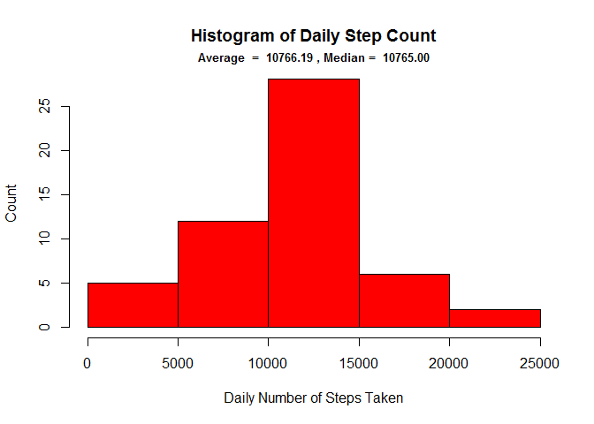
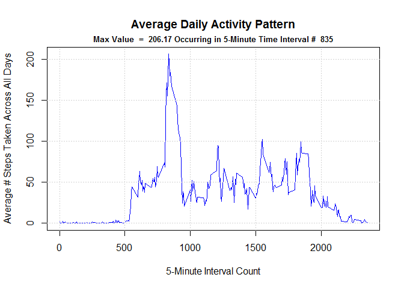
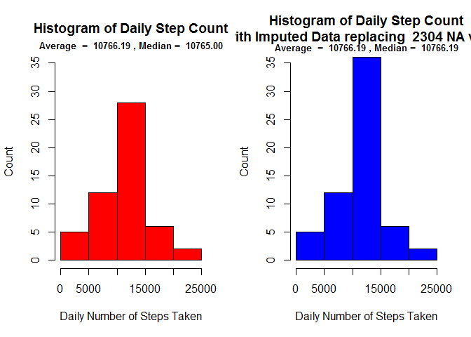
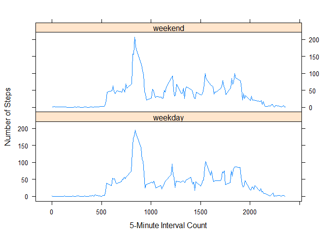

## Loading and preprocessing the data

```r
library(plyr)        # For join
library(dplyr)       # For filter
library(data.table)  # For aggregate
library(ggplot2)     
library(lattice)

# (1) Load and Pre-process Data ----------------------------------------------------------------------------

url <- "https://d396qusza40orc.cloudfront.net/repdata%2Fdata%2Factivity.zip"
download.file( url, file.path( getwd(), "zipfile.zip")) 
unzip("zipfile.zip")

data <- read.csv("./activity.csv", stringsAsFactors = F )

steps <- data$steps
dates <- as.Date( data$date ) 
times <- data$interval
```

## What is mean total number of steps taken per day?
The average and median daily step count are recorded in the title of the following histogram.


```r
# (2 + 3) Mean Total Number of Steps per Day ---------------------------------------------------------------
#         Histogram of total number of daily steps taken, **noting mean and median values in plot title**

sum_steps_per_day <- aggregate( steps ~ dates, data, sum )

avg_steps <- mean  ( sum_steps_per_day$steps )
med_steps <- median( sum_steps_per_day$steps )

#png( "C5W2-Plot1.png", width = 900, height = 700, units = "px")
par( mfrow = c(1,1))

hist( sum_steps_per_day$steps, col = "red", xlab = "Daily Number of Steps Taken", ylab = "Count", 
      main = "Histogram of Daily Step Count" )
title( main = paste("Average  = ", sprintf('%8.2f', avg_steps), 
                    ", Median = ", sprintf('%8.2f', med_steps)), line = 0.5, cex.main = 0.8 )
```

<!-- -->

```r
#dev.off()
```

## What is the average daily activity pattern?
The maximum daily step count and its interval are recorded in the title of the following time-series plot.


```r
# (4 and 5) Average Daily Activity Pattern -----------------------------------------------------------------
#           Time series plot of the average number of daily steps taken, **noting max value and its interval**

sum_steps_per_interval <- aggregate( steps ~ times, data, sum )
avg_steps_per_interval <- aggregate( steps ~ times, data, mean )
med_steps_per_interval <- aggregate( steps ~ times, data, median )

max_value <- max( avg_steps_per_interval$steps )
max_inter <- avg_steps_per_interval$times[ which.max( avg_steps_per_interval$steps )]

#png( "C5W2-Plot2.png", width = 900, height = 700, units = "px")
par( mfrow = c(1,1))

plot( avg_steps_per_interval$times, avg_steps_per_interval$steps, type='l', col = "blue", lwd = 1.5,
      xlab = "5-Minute Interval Count", ylab = "Average # Steps Taken Across All Days", 
      main = "Average Daily Activity Pattern")
title( main = paste("Max Value  = ", sprintf('%6.2f', max_value), "Occurring in 5-Minute Time Interval #", 
                                     sprintf('%4d'  , max_inter)), line = 0.5, cex.main = 0.8 )
grid(nx = NULL, ny = NULL, col = "lightgray", lty = "dotted")
```

<!-- -->

```r
#dev.off()
```

## Imputing missing values
Substituting the average step count per interval for any missing values results in an activity change only
in the 10,000 - 15,000 daily step range. The median increases very slightly, but the average is essentially
unchanged.

Experimenting with other strategies for imputing missing data (not demonstrated in the following code chunk)
did result in quite different "after" histograms. For example, substituting a constant value of 100 for any
missing value causes a spike in the 20,000 - 25,000 range, and also increase the mean and median.


```r
# (6 and 7) Imputing Missing Values ------------------------------------------------------------------------
#           Strategy for imputing missing data: substitute average steps per interval for any N/A's
#           Histograms to compare original vs imputed data sets

num_NA <- sum( is.na( data$steps ))                                  # Number of missing data points

rep_factor <- dim(data)[1] / dim(avg_steps_per_interval)[1]
impute_values <- rep( avg_steps_per_interval$steps, rep_factor )     # Prepare an average to replace N/A

impute_idx <- is.na( data$steps )
data_imputed <- data
data_imputed$steps[ impute_idx ] <- impute_values[ impute_idx ]      # Replace at relevant indices

sum_steps_per_dayI <- aggregate( steps ~ dates, data_imputed, sum )

avg_stepsI <- mean  ( sum_steps_per_dayI$steps )
med_stepsI <- median( sum_steps_per_dayI$steps )

#png( "C5W2-Plot3.png", width = 900, height = 700, units = "px")
par( mfrow = c(1,2))

hist( sum_steps_per_day$steps, col = "red", xlab = "Daily Number of Steps Taken", ylab = "Count", 
       main = "Histogram of Daily Step Count", ylim = c(0,35) )
title( main = paste("Average  = ", sprintf('%8.2f', avg_steps), 
                    ", Median = ", sprintf('%8.2f', med_steps)), line = 0.5, cex.main = 0.8 )

hist( sum_steps_per_dayI$steps, col = "blue", xlab = "Daily Number of Steps Taken", ylab = "Count", ylim = c(0,35),
       main = paste("Histogram of Daily Step Count\n (with Imputed Data replacing ", sprintf('%4d', num_NA), "NA values)") ) 
title( main = paste("Average  = ", sprintf('%8.2f', avg_stepsI), 
                    ", Median = ", sprintf('%8.2f', med_stepsI)), line = 0.3, cex.main = 0.8 )
```

<!-- -->

```r
#dev.off()
```

## Are there differences in activity patterns between weekdays and weekends?

We can see that there is generally an increase in activity on weekends as compared to weekdays. There is also no
significant peak for weekend activity, whereas this is quite noticeable for weekdays.


```r
# (8) Differences in Activity Patterns: weekdays vs weekends -----------------------------------------------
#     Panel plot comparing average number of daily steps taken across weekdays and weekends

w <- data_imputed                                                    # Start with imputed data set
w$weekend <- as.factor(c("weekday","weekend"))                       # Add a 2-level factor to imputed set
colnames( w ) <- c("steps","dates","times", "DayType")

avg_steps_per_interval_DayType <- aggregate( steps ~ times + DayType, w, mean )

#png( "C5W2-Plot4.png", width = 900, height = 700, units = "px")
par( mfrow = c(1,2))

xyplot( avg_steps_per_interval_DayType$steps ~ avg_steps_per_interval_DayType$times | DayType, 
        data = avg_steps_per_interval_DayType, layout = c(1,2), type = "l",
        xlab = "5-Minute Interval Count", ylab = "Number of Steps", title = "Weekday / Weekend Activity Comparison")
```

<!-- -->

```r
#dev.off()
```
      
